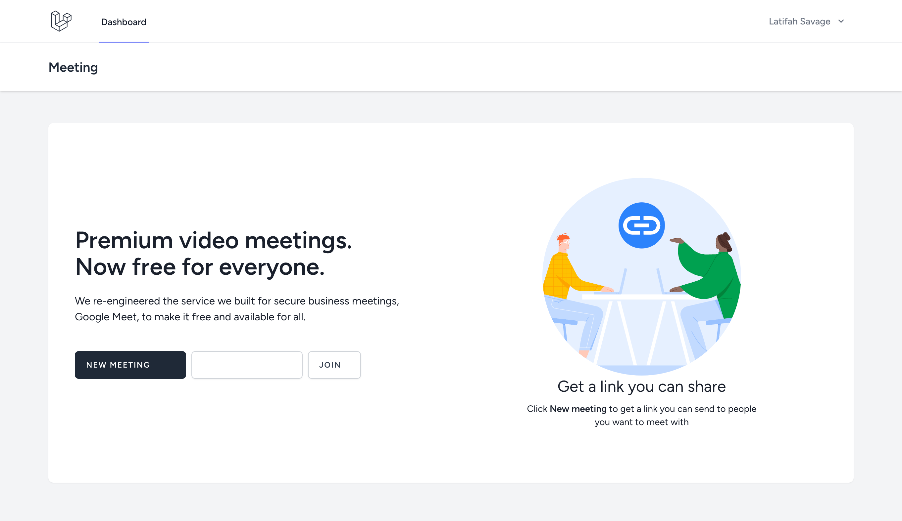
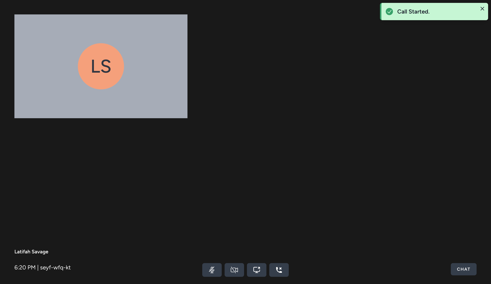

# Google meet clone using laravel and webrtc

This is a group video calling app with `Laravel` and `reactjs` using `websocket` and `WebRTC` technology 

## Prerequisites

- [x] php 8.1 or above
- [x] MYSQL 8.0
- [x] COMPOSER
- [x] SOKETI
- [x] Node.js 18 or above

## Features

- [x] group `video call`
- [x] Audio `Mute/Unmute` and Video `hide/show`
- [x] `Screen sharing`
- [x] Retry when switch B/W `network` (mobile network to wifi or if wifi restart call will try to reconnect.)

## How run the application

- copy `.env.local.example` to `.env.local` file with correct data
- Install dependencies

```bash
composer install
```

- run local development server

```bash
php artisan serve
```
>NOTE:- Run this way as video and audio supported on `https` or `localhost` don't use any test url 

- run websocket server

```bash
apt install -y git python3 gcc build-essential
```

```bash
npm install -g @soketi/soketi
```
you can also follow https://docs.soketi.app/getting-started/installation/cli-installation

```bash
npm run socket:start
```

Open [http://localhost:8000](http://localhost:8000) with your browser to see the result.


# Screen shots



